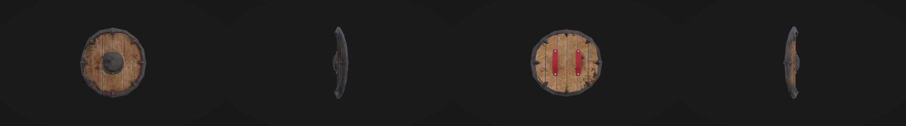
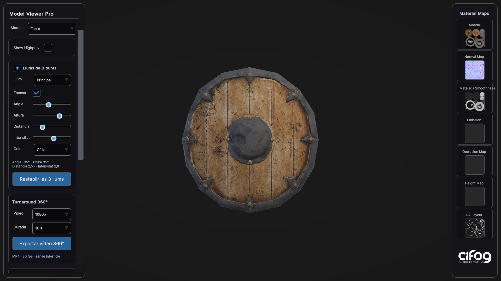
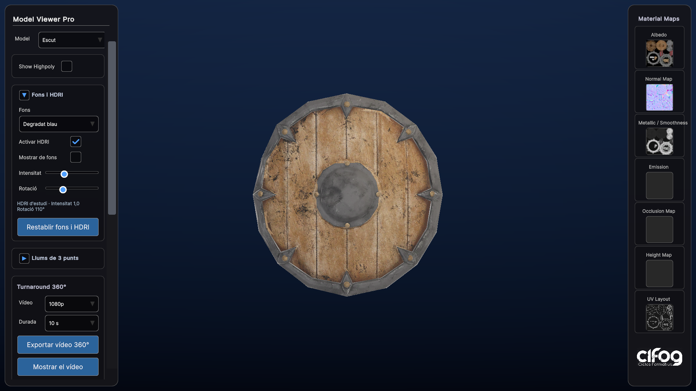
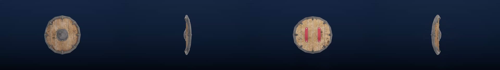

# Revisió del projecte · 10/09/2026

## Resultat

Preparades Viewer.unity i Escenari.unity, amb un prefab Escut que conté Lowpoly i Highpoly. L'escenari demostra tres instàncies del mateix objecte; el selector Model en mostra una. El catàleg es reconstrueix des de l'escena de l'escenari i identifica objectes per prefab, incloent-hi Prefab Variants.

## Correccions

- Agrupació explícita amb Academic Model, sense deduir identitats a partir de fragments com «low» dins d'un nom.
- Models sense una de les variants: es mostra la disponible i es desactiva el commutador.
- Recompte de tots els submeshes triangulars, també amb Read/Write desactivat.
- Centrat de càmera sobre els límits del model, sense desplaçar els contenidors; enquadrament segons el camp de visió i la proporció de pantalla.
- Inicialització del visor i de la interfície per esdeveniments, eliminant l'espera fixa de mig segon.
- Materials seleccionables també en mode UV/Vertex Color i etiquetes diferenciades si tenen el mateix nom.
- UV separades per variant, exclusió del wireframe del recompte i del dibuix UV, comprovació de lectura de les malles i alliberament de recursos generats.
- Tancament del zoom abans d'alliberar textures temporals.
- Escut orientat de cara i il·luminació frontal ajustada.
- Substituït el generador antic d'interfície uGUI, incompatible amb l'actual StudentUIHook de UI Toolkit.
- Documentació reescrita per descriure les funcionalitats presents.

## Verificació

Compilació i proves en Unity 6000.4.9f1:

- **65 comprovacions de validació superades**: integritat de prefabs i referències, catàleg sincronitzat, absència de scripts perduts a les dues escenes, ordre d'escenes i proves de recompte/variants.
- Prova en Play: una entrada Escut, **22.264 triangles lowpoly** i **125.440 triangles highpoly**.
- Comprovats el desplegable Model, els callbacks de Highpoly i la disponibilitat de materials en mode UV.
- Captura de la interfície completa revisada visualment: [visor.png](visor.png).

El menú **Visor 3D > Validar projecte i proves de regressió** permet repetir les comprovacions d'edició. Les proves d'interacció es poden reproduir seguint la primera prova de la guia.

## Abast i límits

La incorporació de models es fa important-los a Unity i preparant prefabs; no s'ha implementat càrrega de fitxers des del navegador en execució. L'escenari és un exemple amb escuts, no una taverna completa. No s'ha generat ni verificat una compilació distribuïble Windows/WebGL. El wireframe actual és per a malles estàtiques i la vista UV cobreix l'espai 0–1.

## Ampliació: vídeo turnaround 360°

Afegit un bloc al panell per exportar una volta completa del model en MP4/H.264, amb durades de 5/10/15/20 segons i resolució 720p/1080p a 30 fps. La captura usa una càmera separada, exclou la interfície i conserva la variant i els materials seleccionats. L'enquadrament es calcula per a tota la volta. La posició, rotació, control de càmera i temps es restauren tant en acabar com en cancel·lar.

Verificat a Windows en Unity 6000.4.9f1:

- Exportació real d'un escut lowpoly a 1920×1080.
- Descodificació correcta amb VideoPlayer i comprovació independent amb ffprobe: H.264, 300 fotogrames, 30 fps, 10 segons exactes.
- Restauració del model i del temps de simulació després de gravar.
- Cancel·lació sense conservar fitxers parcials.
- Revisió visual dels angles 0°, 90°, 180° i 270° i del panell d'exportació.
- Les 65 comprovacions de regressió del projecte continuen passant.

La implementació utilitza el codificador inclòs a Unity Editor. La funció queda desactivada a les aplicacions compilades i a WebGL. No s'ha provat l'exportació a macOS.

## Ampliació: il·luminació de tres punts

Afegits tres focus de runtime, amb controls independents d'angle, altura, distància, intensitat, color i encès. Els focus apunten al centre del model i es reposicionen segons la seva mida. Les preferències es mantenen en canviar de model o variant dins de la sessió. La resta de llums de l'escena del visor es desactiven temporalment i es restauren en desactivar el sistema; no es modifiquen els assets de l'escenari.

Verificacions superades:

- Tres focus actius per defecte i orientats al model.
- Moviment mitjançant els controls del panell, distància relativa i ajustos independents.
- Color, intensitat, encès, canvi de variant, desactivació/reactivació del sistema i restabliment.
- Bloqueig del bloc de llums durant la gravació, inclòs el botó de restabliment.
- Exportació real H.264 de 5 segons a 1280×720, 150 fotogrames a 30 fps; els focus es mantenen fixos durant tota la volta.
- Revisió visual del panell i del vídeo exportat; les 65 comprovacions anteriors continuen passant.

## Ampliació: fons i HDRI

Afegits cinc fons (negre, gris, clar, degradat gris i degradat blau) i un HDRI d'estudi CC0, inclòs localment. La càmera té un fons independent de l'entorn que il·lumina el model. L'HDRI permet controlar intensitat, rotació i visibilitat del panorama. Els reflexos es recalculen després dels ajustos, sense capturar el mateix model, i es mantenen fixos durant el turnaround.

Verificat en Play a Windows:

- 23 comprovacions dels controls, render dels cinc fons, independència entre fons i il·luminació, canvi de variant, restabliment i desactivació/reactivació.
- Il·luminació HDRI amb els tres focus apagats: el model rep llum i reflexos; amb intensitat zero queda negre, mentre el degradat no canvia. Comprovat també el canvi de la llum ambiental.
- Exportació H.264 amb degradat blau i HDRI: 1280×720, 150 fotogrames, 30 fps, 5 segons. Controls de fons bloquejats durant la gravació.
- Revisió visual del panell i dels quatre angles del vídeo.
- Segona exportació amb el panorama HDRI visible: mateix format i durada, fons estable durant la volta.
- Les 65 comprovacions de regressió del projecte continuen passant; sense errors de compilació a la revisió final.

El sistema habilita temporalment els reflexos en temps real, desactivats als perfils originals del projecte, i en restaura la configuració en apagar l'HDRI. La càmera d'exportació rep explícitament el component de fons, que Camera.CopyFrom no copia.

## Separació de les eines docents

El projecte distribuïble conté exclusivament el visor i les eines de preparació de models. S'han retirat els components antics d'accés i correcció de totes les escenes, i el comptador de geometria ja no depèn de cap avaluador.

Comprovacions després de la separació:

- 65 comprovacions de regressió superades.
- Totes les escenes, inclosa SampleScene, sense scripts perduts.
- En Play: catàleg amb una sola entrada, canvi lowpoly/highpoly, recomptes 22.264/125.440 triangles, HDRI disponible i sistema de llums present.
- Exportació d'un projecte net amb una llista explícita de carpetes; sense historial Git, carpetes temporals, registres ni mòduls docents.

L'historial local anterior no s'ha reescrit. Per compartir el projecte s'ha d'utilitzar l'entrega neta de Deliveries; no el directori de treball complet ni un clon amb l'historial antic.
