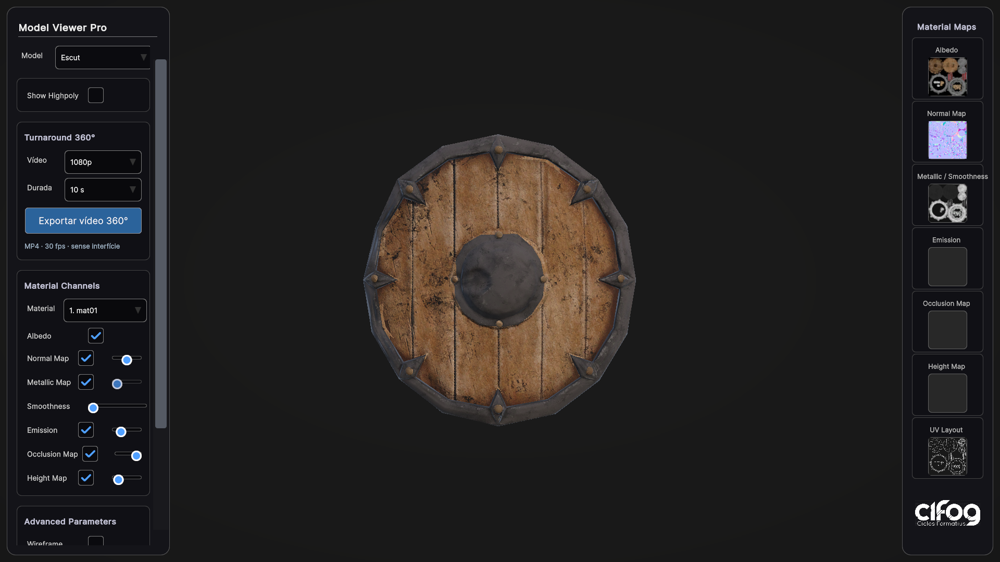

# Guia del visor 3D acadèmic

## Què trobaràs en obrir el projecte

Obre el projecte amb **Unity 6000.4.9f1**, la versió amb què s'ha preparat. Utilitza URP i UI Toolkit.

- **Assets/Scenes/Viewer.unity**: escena 1, amb el panell **Model Viewer Pro**.
- **Assets/Scenes/Escenari.unity**: escena 2, on construeixes el teu escenari.
- **Assets/Models/Escut.prefab**: exemple d'objecte amb les dues variants.
- **Assets/Models/StageCatalog.asset**: llista de prefabs que el visor pot mostrar.
- **SampleScene.unity**: escena original conservada com a referència. Comença amb Viewer.

L'escenari inicial és una demostració amb tres escuts, no una taverna acabada. Les tres còpies comparteixen prefab i apareixen com **un sol Escut** al selector Model. Pots substituir aquest exemple per una taverna, un laboratori o qualsevol altre escenari.

## Primera prova

1. Obre **Viewer.unity** i prem **Play**.
2. A **Model**, selecciona Escut.
3. Activa **Show Highpoly** per alternar entre variants.
4. Prova els canals de material, Wireframe, Vertex Colors i UV Checker. Les imatges de la galeria es poden ampliar amb un clic.
5. Atura Play abans de modificar i desar el projecte.

Controls: botó esquerre per orbitar; dret o central per desplaçar; rodeta per apropar/allunyar; **F** per tornar a centrar el model seleccionat. La càmera s'ajusta automàticament en canviar de model o variant.

Si un model només té una variant, es mostra aquesta variant i el selector de highpoly queda desactivat. Els materials amb el mateix nom tenen números al desplegable per poder distingir-los.

## Canviar el fons i activar l'HDRI

Al bloc **Fons i HDRI** del panell esquerre:

1. Tria **Negre**, **Gris**, **Clar**, **Degradat gris** o **Degradat blau**. El visor comença amb el degradat gris.
2. Marca **Activar HDRI** per afegir la il·luminació i els reflexos d'un estudi fotogràfic. Es combina amb els tres focus, que pots ajustar o apagar individualment.
3. Marca **Mostrar de fons** si també vols veure l'estudi darrere del model. Si ho deixes desmarcat, conserves el fons escollit i continues tenint els reflexos de l'HDRI.
4. Ajusta **Intensitat** i **Rotació**. Espera que desaparegui «Actualitzant reflexos…» abans d'exportar.
5. **Restablir fons i HDRI** recupera el degradat gris i desactiva l'HDRI.

Els fons sòlids i degradats no canvien la il·luminació del model. El degradat es manté vertical quan orbites. Els ajustos es conserven en canviar de model o variant durant Play, i el vídeo 360° utilitza el mateix fons i HDRI. Durant la gravació, aquests controls queden bloquejats.

S'inclou **Studio Small 09**, de Sergej Majboroda / [Poly Haven](https://polyhaven.com/a/studio_small_09), en resolució 1K i amb llicència CC0. No cal connexió a Internet per utilitzar-lo. Per substituir-lo, importa una panoràmica HDR/EXR equirectangular i assigna-la al material **Assets/Resources/Viewer/StudioEnvironment.mat**, mantenint el shader Skybox/Panoramic i la projecció Latitude-Longitude. Els controls utilitzen una còpia temporal d'aquest material. El selector actual inclou un únic HDRI d'estudi, no una biblioteca d'HDRIs.


## Reil·luminar el model

En prémer Play, el visor prepara **tres focus dirigits al centre del model**:

- **Principal:** defineix la il·luminació dominant, des d'un costat i una posició elevada.
- **Farciment:** aporta llum més suau des de l'altre costat.
- **Contorn:** il·lumina des de darrere per remarcar el volum i el perfil.

Al bloc **Llums de 3 punts** del panell esquerre:

1. Tria la llum al desplegable **Llum**.
2. Mou **Angle** per fer-la girar al voltant del model i **Altura** per pujar-la o baixar-la.
3. Mou **Distància** per apropar-la o allunyar-la; sempre continua apuntant al centre del model.
4. Ajusta **Intensitat**, tria un **Color** o desmarca **Encesa** per apagar només aquella llum.
5. Prem **Restablir les 3 llums** per recuperar l'esquema inicial.

El resum sota els controls mostra els angles en graus, la distància relativa a la mida del model i la intensitat. Hi ha colors blanc, càlid, fred, vermell, blau i verd. Pots plegar el bloc fent clic al seu títol i desplaçar el panell amb la rodeta.

Les llums s'adapten a la mida i al centre del model seleccionat. Els ajustos es conserven quan canvies de model o de lowpoly a highpoly durant la mateixa sessió. En tornar a entrar a Play es recuperen els valors inicials. Les llums es queden fixes quan orbites la càmera; no giren amb ella.

En Play, les trobaràs a la jerarquia sota **ModelLoader > Three Point Lighting**, amb els objectes **Key - Principal**, **Fill - Farciment** i **Rim - Contorn**. El visor substitueix temporalment les altres llums de la seva escena i en restaura l'estat quan es desactiva el sistema. Les llums d'Escenari.unity es mantenen independents.

L'exportació de vídeo utilitza aquesta mateixa il·luminació. Els controls de llums, inclòs el botó de restabliment, queden bloquejats durant la gravació. Les llums continuen fixes i el model gira. Els materials Unlit, com el mode Vertex Color, no responen a la il·luminació de la mateixa manera que un material Lit.


## Exportar un vídeo turnaround 360°

Aquesta funció funciona **en mode Play dins de l'editor Unity, a Windows/macOS**. La implementació actual no exporta vídeo des de l'aplicació compilada ni des del navegador.

1. Obre Viewer i prem Play. Selecciona el model i la variant lowpoly o highpoly.
2. Deixa els materials i els diagnòstics tal com vulguis que apareguin al vídeo. Orienta la càmera per establir la vista inicial.
3. Al bloc **Turnaround 360°** del panell esquerre, selecciona **1080p** o **720p**, i una durada de **5, 10, 15 o 20 segons**.
4. Prem **Exportar vídeo 360°**. El model fa una volta completa al voltant del seu centre; la càmera s'enquadra per evitar retallar-lo durant la volta.
5. Espera que aparegui «Vídeo desat a Recordings» i prem **Mostrar el vídeo** per localitzar l'MP4.

El vídeo es desa a la carpeta **Recordings**, a l'arrel del projecte, amb un nom que inclou el model, la variant i la data. Cada exportació crea un fitxer nou. El format és **MP4/H.264 a 30 fps**, sense àudio i sense els panells del visor.

La gravació es genera fotograma a fotograma: pot trigar més que la durada final del vídeo, segons la geometria i l'ordinador. Durant el procés es pausen el temps de simulació i els controls d'inspecció. Pots prémer **Cancel·lar gravació**. En acabar o cancel·lar, es restauren la posició i la rotació del model, el control de càmera i el temps de simulació; un vídeo cancel·lat no es conserva com a exportació acabada. Aturar Play també cancel·la la gravació.

El panell esquerre es pot desplaçar amb la rodeta per accedir als controls que quedin més avall. Les gravacions no s'inclouen al repositori Git.

La codificació utilitza l'[API MediaEncoder de Unity](https://docs.unity3d.com/6000.0/Documentation/ScriptReference/Media.MediaEncoder.html), disponible només a l'editor, sense instal·lar Unity Recorder ni altres paquets.



## Afegir un model nou

En aquest projecte, afegir o «penjar» models vol dir **importar-los a Unity i preparar-los com a prefabs**. El visor no incorpora un selector de fitxers del navegador ni càrrega de GLB per arrossegar-los en execució.

1. Crea una carpeta per a l'objecte, per exemple:

   ```text
   Assets/Models/Cadira/
       Meshes/
       Materials/
       Textures/
   ```

2. Arrossega els FBX a Meshes i les textures a Textures des de l'explorador. Configura els materials URP i assigna'ls a les malles.
3. A l'escena Escenari, utilitza **Visor 3D > Crear grup de model (Lowpoly + Highpoly)**.
4. Canvia el nom de l'arrel a **Cadira** i el camp **Display Name** del component Academic Model a **Cadira**.
5. Arrossega la geometria de cada versió dins del fill corresponent:

   ```text
   Cadira                       ← Academic Model
   ├── Lowpoly                  ← camp Lowpoly
   │   ├── Seient
   │   └── Potes
   └── Highpoly                 ← camp Highpoly
       ├── Seient
       └── Potes
   ```

6. Les dues versions han de compartir escala, orientació i punt d'origen. Mantén l'arrel amb escala 1 i evita posar geometria fora de les variants. Pots tenir tantes peces i subcarpetes com calgui dins de cada variant.
7. Deixa Lowpoly actiu i Highpoly inactiu per muntar l'escenari. Si només tens una versió, elimina el contenidor buit i deixa el seu camp sense assignar.
8. Arrossega l'arrel Cadira des de Hierarchy fins a la carpeta del model al panell Project. Unity crearà **Cadira.prefab**.
9. Col·loca aquest prefab a l'escenari tantes vegades com vulguis.
10. Desa l'escena i executa **Visor 3D > Actualitzar catàleg des de l'escena activa**.
11. Torna a Viewer i prem Play. Cadira ja apareixerà al selector Model.

Per disposar de wireframe i del dibuix UV, activa **Read/Write** a la configuració d'importació del FBX i prem Apply. Sense aquesta opció, la visualització normal i el recompte continuen funcionant; aquests diagnòstics de geometria no estaran disponibles. El wireframe actual cobreix MeshFilter estàtics; les UV i les estadístiques també admeten SkinnedMeshRenderer. El dibuix UV representa l'espai 0–1 i no és un inspector UDIM.

## Com s'eviten els duplicats

El catàleg recorre tots els grups **Academic Model** de l'escenari, també dins de contenidors i objectes inactius. Recull una sola entrada per **prefab**.

- Deu instàncies de Cadira.prefab: una entrada.
- Cadira.prefab i una Prefab Variant CadiraVermella.prefab: dues entrades.
- Dos prefabs diferents amb el mateix Display Name: dues entrades amb noms diferenciats al visor.
- Un FBX solt sense Academic Model: no es registra. Cal preparar-ne el grup.

La posició, rotació i escala de les còpies a l'escenari no creen models nous. Per canviar geometria, materials o variants, edita el prefab original. Si has modificat una instància, aplica els canvis al prefab amb **Overrides > Apply All**, o crea una **Prefab Variant** si vols una versió diferent. L'actualització del catàleg avisa si troba canvis pendents perquè el visor mostra el prefab, no les modificacions locals d'una còpia.

No posis un Academic Model dins d'un altre Academic Model. Per agrupar mobiliari, utilitza un GameObject contenidor sense aquest component.

## Relació entre les escenes

El visor crea còpies dels prefabs del catàleg sota:

```text
ModelLoader
└── ModelsContainer
    ├── Cadira
    │   ├── Lowpoly
    │   └── Highpoly
    └── Escut
        ├── Lowpoly
        └── Highpoly
```

Aquesta jerarquia es genera en prémer Play. Només queda visible el model seleccionat i la seva variant activa. Les còpies i els materials del visor són temporals: provar canals o canviar de model no modifica l'escenari ni els materials originals.

No cal carregar l'escena de l'escenari alhora que Viewer. El catàleg conté referències als assets i també funciona en una compilació. Per visitar l'escenari a l'editor, atura Play i obre Escenari.unity.

Després d'afegir o retirar objectes de l'escenari, **actualitza el catàleg**. Canviar la geometria d'un prefab ja registrat s'hi reflecteix directament. Un prefab que simplement existeix a Assets però que no està col·locat a l'escenari no s'afegeix automàticament.

## Comprovar i preparar una entrega

1. Desa els prefabs i l'escenari.
2. Actualitza el catàleg des d'Escenari.
3. Executa **Visor 3D > Validar projecte i proves de regressió**. Si hi ha un problema, la Console explica què cal corregir.
4. Prova Viewer en Play, incloent-hi els models nous, les variants i els materials.
5. A Build Profiles, mantén **Viewer** com a primera escena i **Escenari** com a segona.
6. Comparteix Assets, Packages, ProjectSettings i aquesta guia; no cal compartir Library, Temp o Logs.

El menú **Preparar les dues escenes (primera vegada)** és una eina de migració de l'escena original. Les escenes ja estan preparades en aquest projecte; el menú evita sobreescriure-les.

## Resolució de problemes

| Situació | Què has de revisar |
|---|---|
| El model no surt a Model | El grup té Academic Model, està desat com a prefab i s'ha actualitzat StageCatalog des de l'escenari correcte. |
| Canviar de variant no mostra la geometria esperada | Els camps Lowpoly i Highpoly apunten als fills correctes i no al mateix objecte ni a l'arrel. |
| Apareixen dues cadires al selector | Són prefabs diferents? Per repetir el mateix objecte, instancia el mateix prefab. |
| El visor mostra una versió antiga | Aplica els canvis de la instància al prefab o crea'n una Variant. |
| Wireframe o UV no es dibuixen | Revisa Read/Write i que la malla tingui triangles i coordenades UV. |
| La textura surt rosa | El material necessita un shader compatible amb URP. |
| L'objecte es veu massa petit a l'escenari | Comprova les unitats del FBX i l'escala d'importació. El visor ajusta la càmera, però no canvia la mida real del model. |

## Projecte per a l'alumnat

Aquesta versió conté el visor i les eines de preparació de models. No incorpora un panell de professor ni calcula qualificacions. Les estadístiques de triangles i vèrtexs són eines d'inspecció.

Per compartir una còpia neta, executa **Tools/Export-StudentProject.ps1** amb PowerShell. El ZIP resultant es desa a **Deliveries** i inclou Assets, Packages, ProjectSettings, documentació i eines d'exportació. Descomprimeix-lo i obre la carpeta Visor3D-Alumnat amb Unity Hub. El paquet exclou l'historial Git, les carpetes temporals, els registres i les gravacions. No comparteixis la carpeta de treball sencera ni un clon amb l'historial antic.
