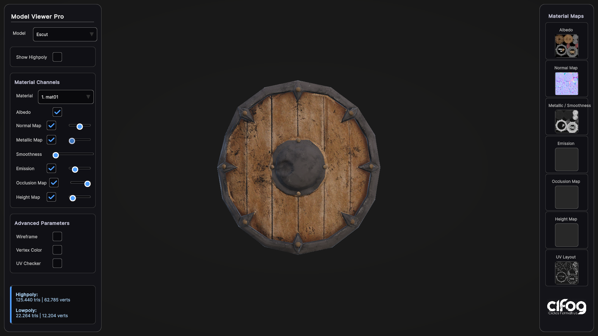

# Visor 3D acadèmic

Projecte Unity **6000.4.9f1 · URP · UI Toolkit** per inspeccionar models d'un escenari acadèmic.

**Versió per a l'alumnat.** El projecte conté el visor i les eines de models; la correcció es fa en una eina docent separada. Per generar una entrega neta sense historial Git, executa `Tools/Export-StudentProject.ps1`; trobaràs el ZIP a `Deliveries`.

Obre **Assets/Scenes/Viewer.unity** i prem **Play**. El desplegable **Model** del panell Model Viewer Pro mostra els objectes únics del catàleg i permet alternar lowpoly/highpoly.

- **Viewer.unity**: visor amb càmera orbital, materials, wireframe, UV i estadístiques.
- **Escenari.unity**: escena independent on col·locar els prefabs. Inclou tres còpies de l'escut com a demostració de deduplicació.
- **Escut.prefab**: arrel Escut amb fills Lowpoly i Highpoly, identificats amb Academic Model.
- **StageCatalog.asset**: catàleg compartit. Actualitza'l amb **Visor 3D > Actualitzar catàleg des de l'escena activa**, des de l'escenari.

Cada prefab apareix una sola vegada al visor encara que estigui repetit a l'escenari. Els materials d'inspecció són còpies temporals i no modifiquen els originals.

**Il·luminació:** el visor crea tres focus per defecte (principal, farciment i contorn). Des del bloc Llums de 3 punts pots moure'ls amb els controls d'angle, altura i distància, ajustar-ne intensitat i color, apagar-los individualment o restablir l'esquema inicial. La mateixa il·luminació s'utilitza al vídeo 360°.

**Fons i HDRI:** fons negre, gris, clar i dos degradats. Inclou un HDRI d'estudi CC0 amb intensitat i rotació ajustables; pots utilitzar-lo per il·luminar i generar reflexos, i decidir independentment si es mostra com a fons. També s'aplica als vídeos 360°.

Consulta **[GUIA_D_US.md](GUIA_D_US.md)** per importar models, preparar grups, muntar l'escenari, actualitzar el catàleg i resoldre problemes.

**Vídeo 360°:** en Play dins de Unity (Windows/macOS), el bloc Turnaround 360° permet exportar MP4 a 720p/1080p i 30 fps. Els vídeos es desen a Recordings, sense interfície ni àudio. Aquesta exportació encara no està disponible en aplicacions compilades.

Per comprovar el projecte: **Visor 3D > Validar projecte i proves de regressió**.

Els models s'importen i es preparen a Unity. No hi ha càrrega de fitxers GLB per arrossegar-los al navegador en execució. SampleScene.unity es conserva com a referència de la versió original.
